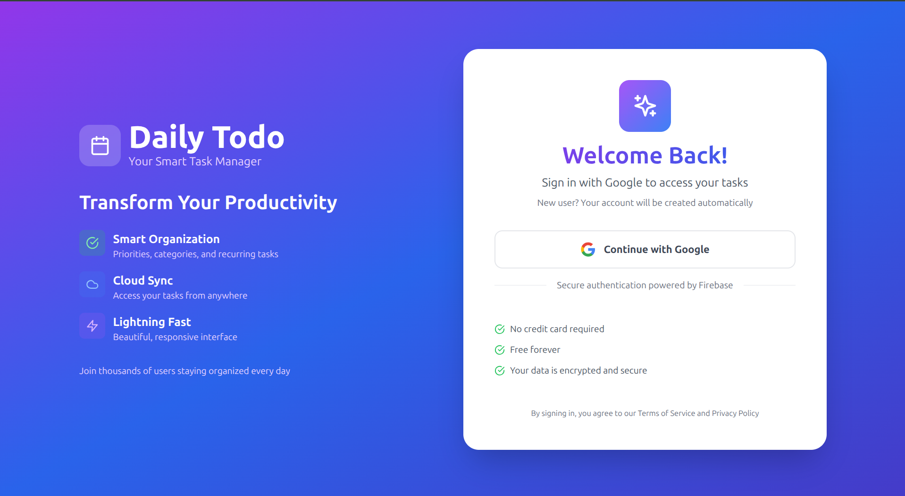
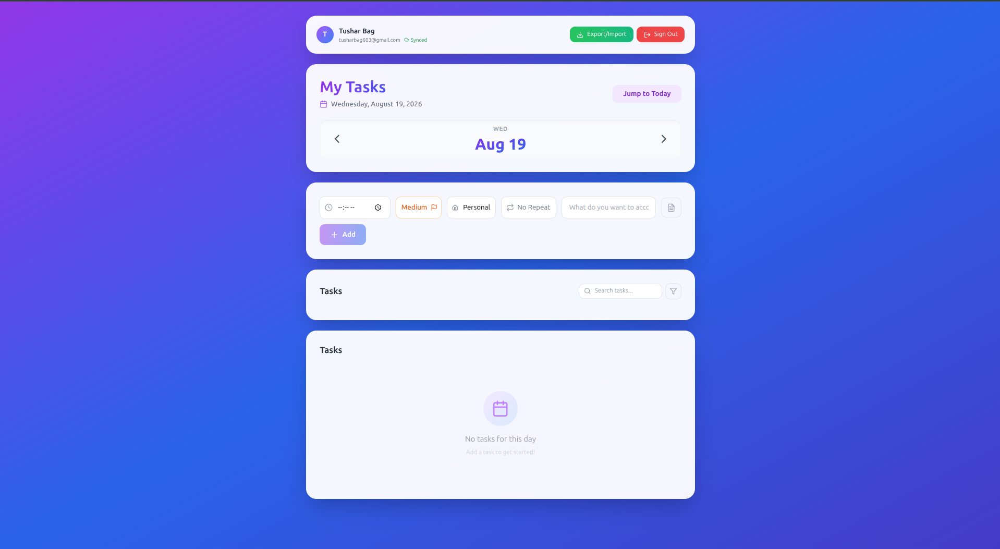

# Daily Todo App

> Plan your day, achieve your goals — a beautiful, cloud-synced daily task manager.

Daily Todo is a progressive web app (PWA) for organizing tasks by day. It features
Google authentication, cloud sync via Firebase, recurring tasks, priority/category
labels, search & filtering, progress tracking, and export/import in JSON, CSV, and PDF.


---

## Features

- **Google Sign-In** — secure authentication powered by Firebase Auth, with automatic account creation.
- **Day-based Planning** — navigate between days with prev/next controls and a "Jump to Today" shortcut.
- **Rich Tasks** — each task has a time, priority (high/medium/low), category (personal/work/health/study/other), optional notes, and a completion toggle.
- **Recurring Tasks** — mark a task done and automatically roll it forward daily, weekly, or monthly.
- **Search & Filters** — live search across task text and notes, plus priority and category filters.
- **Progress Tracking** — a visual progress bar showing completed vs total tasks for the selected day.
- **Cloud Sync** — tasks are persisted per-user in Cloud Firestore with a live sync status indicator.
- **Export / Import** — back up and restore tasks as **JSON**, **CSV**, or printable **PDF** (via jsPDF + PapaParse).
- **Profile Management** — editable display name and unique username with availability checks.
- **PWA Install** — installable as a standalone app with an install prompt and offline-ready manifest.
- **Auto Logout** — automatically signs the user out after 2 hours of inactivity.
- **Responsive UI** — mobile-first design with a purple/blue gradient theme built on Tailwind CSS.

---

## Tech Stack

| Layer        | Technology                                   |
|--------------|----------------------------------------------|
| Framework    | React 18 (Create React App)                  |
| Styling      | Tailwind CSS 3 + custom gradients            |
| Routing      | React Router 7                               |
| Auth / DB    | Firebase Auth + Cloud Firestore              |
| Export       | jsPDF, jspdf-autotable, PapaParse            |
| Icons        | lucide-react                                 |
| PWA          | Web App Manifest + install prompt            |

---

## Project Structure

```
todo-forday/
├── public/                 # Static assets, manifest.json, icons
├── src/
│   ├── components/
│   │   ├── AuthSection.jsx     # User header + sync status + sign out
│   │   ├── DateHeader.jsx      # Day navigation header
│   │   ├── TaskForm.jsx        # Add task (time/priority/category/recurrence/notes)
│   │   ├── TaskFilters.jsx     # Search + priority/category filter UI
│   │   ├── TaskList.jsx        # Renders the task collection
│   │   ├── TaskItem.jsx        # Single task (view/edit/delete/toggle)
│   │   ├── TaskProgress.jsx    # Completion progress bar
│   │   ├── ExportImport.jsx    # JSON / CSV / PDF export & import
│   │   └── ProtectedRoute.jsx  # Route guard for authenticated users
│   ├── pages/
│   │   ├── AuthPage.jsx        # Google sign-in landing page
│   │   └── ProfilePage.jsx     # Profile editing + username availability
│   ├── utils/
│   │   └── helpers.js          # Category icon/color + priority helpers
│   ├── DailyTodoApp.jsx    # Main app container + task state logic
│   ├── firebase.js         # Firebase init + auth/Firestore functions
│   ├── App.js             # Router, auth state, inactivity auto-logout
│   ├── InstallPrompt.jsx  # PWA install prompt
│   └── index.js           # Entry point
├── package.json
├── tailwind.config.js
└── postcss.config.js
```

---

## Getting Started

### Prerequisites

- Node.js 16+
- A Firebase project (for Auth + Firestore)

### Installation

```bash
# Clone the repository
git clone https://github.com/Tushar-204/todo-forday.git
cd todo-forday

# Install dependencies
npm install
```

### Firebase Setup

1. Create a project at [console.firebase.google.com](https://console.firebase.google.com).
2. Enable **Authentication → Google** sign-in.
3. Create a **Cloud Firestore** database.
4. Open `src/firebase.js` and replace `firebaseConfig` with your project's web config.

### Run Locally

```bash
npm start
```

The app runs at [http://localhost:3000](http://localhost:3000).

### Build for Production

```bash
npm run build
```

The optimized build is output to the `build/` folder, ready to deploy.

---

## Available Scripts

| Script           | Description                                  |
|------------------|----------------------------------------------|
| `npm start`      | Start the development server                  |
| `npm run build`  | Build the app for production                 |
| `npm test`       | Run tests in interactive watch mode          |
| `npm run eject`  | Eject Create React App config (one-way)      |

---

## Data Model

Tasks are stored per-user in Cloud Firestore at `users/{userId}/tasks/allTasks`:

```json
{
  "2026-08-19": [
    {
      "id": 1692451200000,
      "text": "Morning run",
      "time": "07:00",
      "priority": "high",
      "category": "health",
      "recurrence": "daily",
      "notes": "3km loop",
      "completed": false,
      "createdBy": "local",
      "createdAt": "2026-08-19T07:00:00.000Z"
    }
  ]
}
```

---

## Screenshots

> Add screenshots to `docs/screenshots/` and reference them here to showcase the UI.




---

## Contributing

Contributions are welcome! Please read [CONTRIBUTING.md](CONTRIBUTING.md) for guidelines
on how to submit issues, feature requests, and pull requests.

---

## License

This project is licensed under the MIT License.
